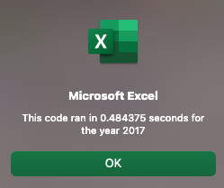
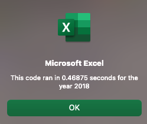

# VBA of Wall Street Stock Analysis

## Overview of Project

### Purpose
This project was focused on determining...

## Analysis and Challenges
The analysis was performed by first...

## Results

### Analysis of 2017 Performance
...  

### Analysis of 2018 Performance
....  

## Summary

- **What are the advantages or disadvantages of refactoring code?**  
...

- **What can you conclude about the Outcomes based on Goals?**  
Generally speaking, there is an inverse relationship between campaign success and fundraising goal. This conclusion is drawn because, with the exception of $35,000-45,000 goals, there was a steady decrease in success rate as fundraising goals increased.

- **How do these pros and cons apply to refactoring the original VBA script?**  
...

