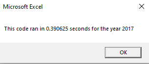
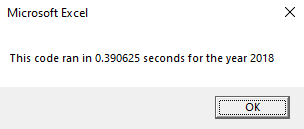

# VBA of Wall Street Stock Analysis

## Overview of Project
This project was focused on refactoring a prior analysis performed on a dozen stocks in the years 2017 and 2018, which gathered information on ticker symbols, annual trading volume, and annual returns. The analysis was performed using macros in Excel VBA.

## Results
The results of the analysis showed that 2017 was a far better year than 2018 for the dozen stocks analyzed, with only one of the stocks having a negative annual returns for 2017 whereas in 2018 there were only two stocks that have positive annual returns. Before the macro to analyze over 3000 rows was refactored, the run time for 2017 and 2018 analyses were 0.433s and 0.430s, respectively, and 0.387s and 0.391s after the macro was optimized to hold data within arrays as opposed to reassigning values for each respective stock.

### Analysis of 2017 Performance
Before refactoring, the macro ran for 0.433s before refactoring and 0.387s afterwards, yielding a 10.6% decrease in runtime.  

### Analysis of 2018 Performance
Before refactoring, the macro ran for 0.0.430s before refactoring and 0.387s afterwards, yielding a 9.1% decrease in runtime.  

## Summary

- **What are the advantages or disadvantages of refactoring code?**  
Advantages of code refactoring include optimizing code to make it more efficient performance-wise, easier to understand, and improve ease of finding bugs. The main disadvantage of code refactoring is the amount of time necessary to perform this task, especially for lengthier code.

- **How do these pros and cons apply to refactoring the original VBA script?**  
...

